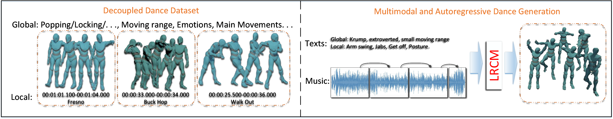
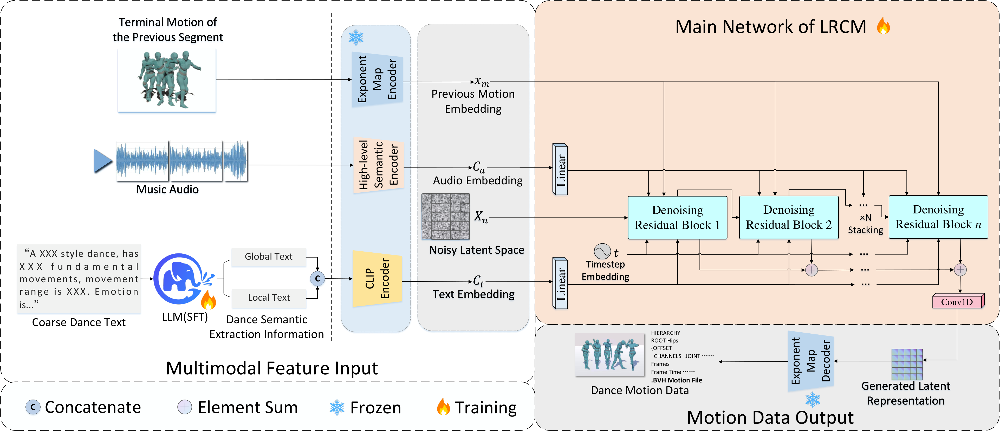

# LRCM: Listen to Rhythm, Choose Movements


**Listen to Rhythm, Choose Movements: Autoregressive Multimodal Dance Generation via Diffusion and Mamba with Decoupled Dance Dataset**

[[Paper]](https://arxiv.org/abs/2601.03323) · [[GitHub]](https://github.com/OranDuanStudy/LRCM) · [[Project Page]](https://oranduanstudy.github.io/LRCM)

**LRCM** (Listen to Rhythm, Choose Movements) is a multimodal-guided diffusion framework for dance motion generation that simultaneously leverages **audio rhythm** and **hierarchical text descriptions** (global style + local movements) for high-quality, controllable dance synthesis.

## Visual Overview

### Overview



### Architecture



## Method Highlights

Current dance motion generation methods suffer from **coarse semantic control** and **poor coherence in long sequences**. LRCM addresses these through:

1. **Decoupled Multimodal Dance Dataset Paradigm** — Fine-grained semantic decoupling of motion, audio, and text
2. **Heterogeneous Multimodal-Guided Diffusion Architecture** — Audio-latent Conformer + Text-latent Cross-Conformer
3. **Motion Temporal Mamba Module (MTMM)** — State space model-based autoregressive extension for long-sequence generation

### Key Features

- **Dual-modality conditioning**: Audio rhythm + Text descriptions (global + local)
- **Autoregressive generation**: Efficient long-sequence synthesis via Mamba SSM
- **7 dance genres**: Hip-hop, Jazz, Krump, Popping, Locking, Charleston, Tap

---

## Installation

```bash
git clone https://github.com/OranDuanStudy/LRCM.git
cd LRCM
pip install -r requirements.txt
```

**Requirements:** Python 3.10+, CUDA 12.x, PyTorch 2.4+, 4× RTX 4090 (24GB)

---

## Project Structure

```
.
├── models/
│   ├── LightningModel.py      # Main Lightning model
│   ├── BaseModel.py
│   ├── nn.py                  # Neural network building blocks
│   ├── mamba/mambamotion.py  # Motion Temporal Mamba Module
│   ├── lgtm/                  # Text encoders & diffusion components
│   │   ├── conformer.py
│   │   ├── text_encoder.py
│   │   ├── motion_diffusion.py
│   │   └── utils/
│   └── transformer/tisa_transformer.py
├── utils/
│   ├── motion_dataset.py      # Dataset loaders
│   └── hparams.py             # Hyperparameter management
├── pymo/                      # Motion preprocessing (BVH, rotations)
├── hparams/
│   ├── LRCM_stage1.yaml       # Phase 1: Global text + Audio
│   ├── LRCM_stage2.yaml       # Phase 2: Add Local text
│   └── LRCM_stage3.yaml       # Phase 3: Enable MTMM
├── train.py                   # Training script
├── synthesize.py               # Inference script
└── requirements.txt
```

---

## Data & Pretrained Models

> **Note:** The text annotations dataset below is **text-only** (global + local text descriptions). You must also download the [Motorica Dance dataset](https://github.com/simonalexanderson/MotoricaDanceDataset/) to obtain the raw motion capture data and audio files for training.

### Enhanced Text Annotations

[[Download (Google Drive)]](https://drive.google.com/drive/folders/1R8jy70f006SOLqkKloBvVFIYFMCDpLSQ?usp=drive_link)

Enhanced text annotations with hierarchical global and local descriptions for 7 dance genres. Place the downloaded files under `data/Multimodal_Text_dataset_updating/`.

### Pretrained Checkpoints

[[Download (Google Drive)]](https://drive.google.com/drive/folders/1q9pfX-6buS2xvGWiNBE9Y9EHUPvWYIKe?usp=drive_link)

Two model versions are provided:

| Checkpoint | Description | Usage |
|------------|-------------|-------|
| `NAR` version | Non-autoregressive model (Phase 2) | `--checkpoints NAR/dance_LRCM_stage2.ckpt` |
| `AR` version | Autoregressive model (Phase 3) | `--checkpoints AR/dance_LRCM_stage3.ckpt` |

---

## Inference

```bash
python synthesize.py \
    --checkpoints ckpt/dance_LRCM_stage3.ckpt \
    --data_dirs data/Multimodal_Text_dataset_updating/ \
    --input_files sample_input.pkl \
    --input_text "dynamic hip-hop dance with arm waves and body rolls" \
    --dest_dir results/
```

**Batch generation:**
```bash
bash experiments/LRCM_manbadance_duainput_memory.sh
bash experiments/LRCM_duainput_memory_json.sh
```

**Arguments:**

| Argument | Description | Default |
|----------|-------------|---------|
| `-c, --checkpoints` | Path to model checkpoint | Required |
| `-d, --data_dirs` | Path to data directory | Required |
| `-f, --input_files` | Input motion file | Required |
| `-t, --input_text` | Text description (global style) | Required |
| `-r, --seed` | Random seed | 42 |
| `--dest_dir` | Output directory | "results" |
| `-m, --segment-frames` | Segment frame length | 300 |

---

## Training

**Phase 1 — Foundation (Global text + Audio):**
```bash
CUDA_VISIBLE_DEVICES=0,1,2,3,4 python train.py \
    --dataset_root data/Multimodal_Text_dataset_updating \
    --hparams_file ./hparams/LRCM_stage1.yaml \
    --ckpt_file None
```

**Phase 2 — Fine-tuning (Add Local text):**
```bash
CUDA_VISIBLE_DEVICES=0,1,2,3,4 python train.py \
    --dataset_root data/Multimodel_Text_dataset_updating \
    --hparams_file ./hparams/LRCM_stage2.yaml \
    --ckpt_file ./pretrained_models/dance_LRCM_stage1.ckpt
```

**Phase 3 — Autoregressive (Enable MTMM):**
```bash
CUDA_VISIBLE_DEVICES=0,1,2,3,4 python train.py \
    --dataset_root data/Multimodal_Text_dataset_updating \
    --hparams_file ./hparams/LRCM_stage3.yaml \
    --ckpt_file ./pretrained_models/dance_LRCM_stage2.ckpt
```

**Training details:** Adam optimizer (weight decay: 1.0e-4), 200 DDPM steps, 20 residual blocks, ~316M parameters.

---

## Citation

```bibtex
@misc{lrcm2026,
  title = {Listen to Rhythm, Choose Movements: Autoregressive Multimodal Dance Generation via Diffusion and Mamba with Decoupled Dance Dataset},
  author = {Oran Duan and Yinghua Shen and Yingzhu Lv and Luyang Jie and Yaxin Liu and Qiong Wu},
  year = {2026},
  eprint = {2601.03323},
  archivePrefix = {arXiv},
  primaryClass = {cs.CV}
}
```
